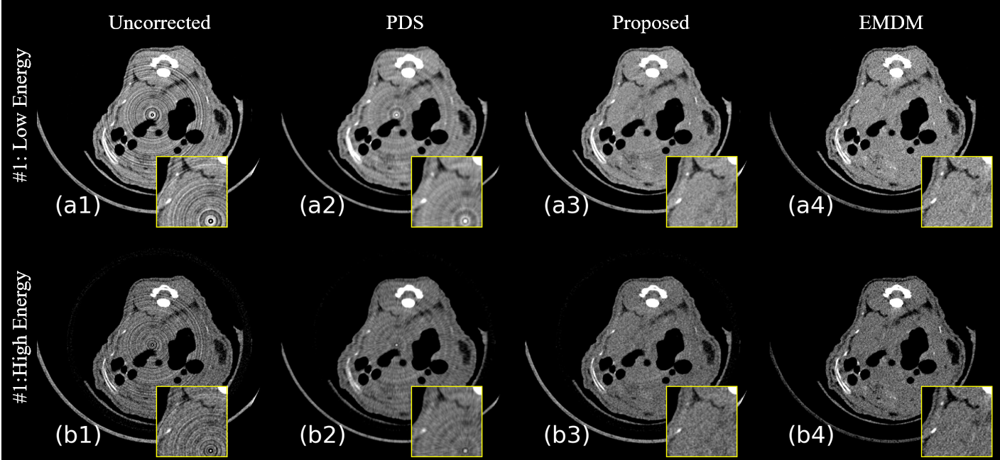

# Zero-Shot PCCT High-Low Frequency Cicular Artifact Reduction based on Dual Domain Optimization and Material Decomposition (ZS HLFCAR-PCCT)

## Whats new?

This is a method for correcting high and low frequency circular artifacts in PCCT, and its advantages include:

- [x] No training data required (Zero-Shot)
- [x] No other projection measurement required
- [x] Based on Pytorch and [torch-mando](https://github.com/SEU-CT-Recon/torch-mando)
- [x] Physical endorsement of projection domain material decomposition
- [x] All optimization processes are differentiable and allow gradient propagation

## Outcome

Uncorrected: raw PCCT image

PDS: polar domain smooth to reduce the ring artifact

EMDM: Experimental material decomposition method, use dual energy and perform projection domain material decomposition (traditional method gold label)

